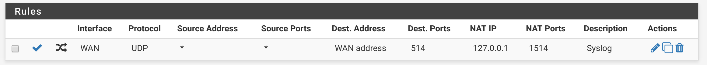

# Minion meets pfSense

## Requirements

pfSense 2.3.4-RELEASE (tested on a Netgate SG-2220 w/ 60GB SSD)

## Setup

> The following instructions require access to the pfSense shell.

Add the package repository, by creating `/usr/local/etc/pkg/repos/minion.conf` with:

```
minion: {
    url: "http://bsdizzle.opennms.org/packages/freebsd_10-3x64-RELENG_2_3_4_MINION/",
    mirror_type: "http",
    signature_type: "pubkey",
    pubkey: "/usr/local/etc/ssl/bsdizzle.cert",
    enabled: yes
}
```

Create `/usr/local/etc/ssl/bsdizzle.cert` with:
```
-----BEGIN PUBLIC KEY-----
MIICIjANBgkqhkiG9w0BAQEFAAOCAg8AMIICCgKCAgEA5o3mfB6hq4f88XsSKbBk
rEMVbH3wxhad75vkM5XYFhROFZ2rfbBy6ComOSScHjrWOHcGKvFkxBhJ1yOl3H1F
c3sxbdV7WFwBRdCWAMAS4QkCjBCrzMNRToO8jyDecKa/3/uKTfFNABmT4oOFgpg9
bY53LdYppOdDBM3RYk+yvJTS8aYpGLtNc7s4eIvfiTHXs4jmBBsB/86xwKjiv8vj
/ACD+1R2BiG1Spr7tx6c0eLdID8+l6/rFLXUS+L3T/SRL7uBIGoi6dsJiF8MvO7B
yrq+Ib4Bd6OD6zVe/ZtkPKwuGflqpCc+FFVVTUnxCoKURF3+TAMYcwi3pstVb4uK
uPd71MLxmVTHSTXT9sz+5Yj8UJBi14JSUYLHgCAFm/secD//+m5p9KkY+JRFaVi0
a78Aqtpah/kCyzJ5JQhlFGiyJkkuqV3qZ8lFe3qoiApSBh83A+5hytQ16EBc4dG1
L0bJSiOL8Lgsrrm0S2rXDU1hxuYI+bXErj9m9dGae3NSBbRHvUaQ0T0LuoFqysU8
XE6d9fHqbU+lSwCfyDooAEJMetAg1kydUSF0mwYT0uHOhiS84Fzi+x9yaFvZ/kJ/
hlmXHYAC0CO9GkW6xMP7O2s2nXwRmVujYnHIgVcI4CLb8VmIBhc4pRXbd1BdT+Jn
aooXOf9gbfMD08srpbNq3FsCAwEAAQ==
-----END PUBLIC KEY-----
```

Update the package repository:

```sh
pkg update
```


Install the Minion package using the Web UI, or directly in the command line using:

```
pkg install pfSense-pkg-minion
```

## Configure your Minion

Once the package has been installed, you can access the **Minion** option in **Services** menu to configure the service.

Enable the service, and point it to your OpenNMS instance:

| Field      | Example value               |
| -----------|:---------------------------:|
| HTTP URL   | http://opennms:8980/opennms |
| Broker URL | tcp://opennms:61616         |
| Location   | HOME                        |

### Configure the credentials

The server cannot currently be set using the UI, instead you need to login to the Karaf shell from the pfSense shell using:

```sh
ssh -oPort=8201 admin@127.0.0.1
```

> The default username and password to the Karaf shell is admin/admin

In the Karaf shell, set the credentials using:

```sh
scv:set opennms.http minion minion
scv:set opennms.broker minion minion
```

Restart the service after setting the credentials.

## Verify your Minion

From the Karaf shell (see above for connecting), verify that the backend is reachable by running:

```sh
minion:ping
```

If communication was successful, you should see output similar to:

```sh
admin@minion>minion:ping
Connecting to ReST...
OK
Connecting to Broker...
OK
admin@minion>
```

Now reboot the appliance, and verify that the service is restarted on reboot, and that all of the checks above still pass.

Congratulations, you're ready to go.

## Configuring Syslog

By default, the Syslog listener in the Minion container will listen on port 1514.

### Accept messages from other devices

To accept Syslog messages on port 514, you can setup a NAT rule that looks like:



### Forward messages from the pfSense appliance

If you're interested in monitoring the pfSense appliance, you can forward its log message to the Minion.

Navigate to `Status -> System Logs -> Settings`

Check `Send log messages to remote syslog server`

Enter `127.0.0.1:1514` as a `Remote Log Server`.

## Known Issues

* Credentials for communicating with OpenNMS can't be configured from the UI
* The packages should be relocated under the `net-mgmt` tree instead of `net`
* The .local repository should be deleted after uninstall / on upgrade


## SSL

Add your certifcate chain to the default trust store using:

```sh
/usr/local/openjdk8/bin/keytool -trustcacerts -keystore /usr/local/openjdk8/jre/lib/security/cacerts -storepass changeit -noprompt -importcert -file chain.pem
```

